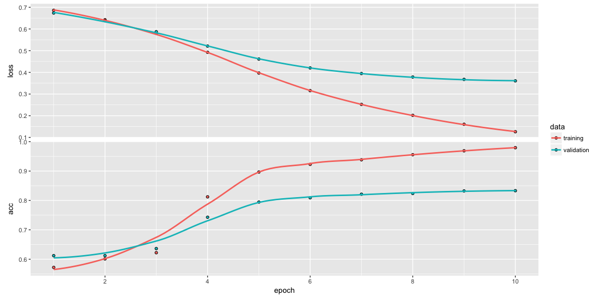
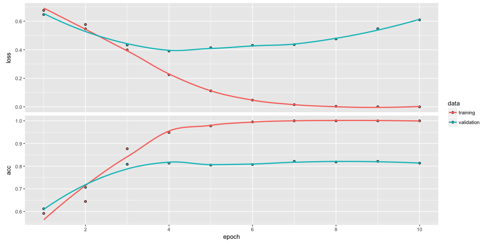
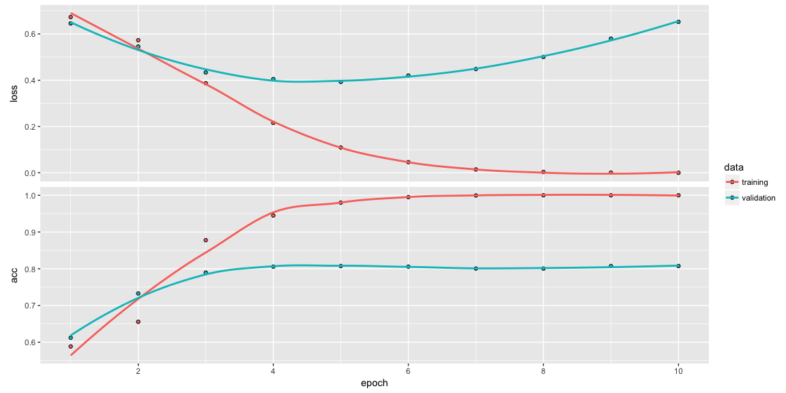

The stupid question
-------------------

If I give you an abstract to read (just the text, forget about the
format), would you be able to tell me in what journal was published?

Let’s start easy. You only have 2 options (50% chance): you have to
differentiate between abstracts in “Diversity and Distributions” and
“Journal of Biogeography”. Two staple journals in Macroecology!

The stupid idea
---------------

Here I use neural networks to classify abstracts by journal. I used all
the abstracts for “Diversity and Distributions” and “Journal of
Biogeography” available in ISI Web of knowledge to train, test and
validate the neural network.

Can you guess the accuracy of the neural network?
-------------------------------------------------

### Neural network model using a embedding layer

    model <- keras_model_sequential() %>% 
            layer_embedding(input_dim = 10000, output_dim = 8, input_length = maxlen) %>% 
            layer_flatten() %>% 
            layer_dense(units=1, activation = "sigmoid")

    model %>%  compile(
            optimizer = "rmsprop",
            metrics = c("accuracy"),
            loss = "binary_crossentropy"
    )

    history <- model %>% fit(
            x_train, 
            y_train, 
            epochs = 10, 
            batch_size = 32, 
            validation_data = list(x_val, y_val)
    )
    plot(history)

The maximum accuracy of this model is 0.83319

### Neural network model using a embedding layer + a densely connected layer

    model <- keras_model_sequential() %>% 
            layer_embedding(input_dim = 10000, output_dim = 8, input_length = maxlen) %>% 
            layer_flatten() %>% 
            layer_dense(units = 32, activation="relu") %>% 
            layer_dense(units=1, activation = "sigmoid")
    # compile
    model %>%  compile(
            optimizer = "rmsprop",
            metrics = c("accuracy"),
            loss = "binary_crossentropy"
    )
    history <- model %>% fit(
            x_train, 
            y_train, 
            epochs = 10, 
            batch_size = 32, 
            validation_data = list(x_val, y_val)
    )
    plot(history)

The maximum accuracy of this model is 0.8211522

### Neural network model using a embedding layer + a densely connected layer + a longer text sequence

    model_lstm_200 <- keras_model_sequential() %>% 
            layer_embedding(input_dim = 10000, output_dim = 8, input_length = maxlen) %>% 
            layer_flatten() %>% 
            layer_dense(units = 32, activation="relu") %>% 
            layer_dense(units=1, activation = "sigmoid")
    # compile
    model_lstm_200 %>%  compile(
            optimizer = "rmsprop",
            metrics = c("accuracy"),
            loss = "binary_crossentropy"
    )

    history <- model_lstm_200 %>% fit(
            x_train, 
            y_train, 
            epochs = 10, 
            batch_size = 32, 
            validation_data = list(x_val, y_val)
    )
    plot(history)

The maximum accuracy of this model is 0.8073947

The stupid result
-----------------

Using these simple neural networks we can classify abstracts by journal
with around 83% of accuracy… Now, can we use the same approach to
classify papers by topic (e.g. latitudinal gradient)? or by traits? or
by taxonomic group?

=======
